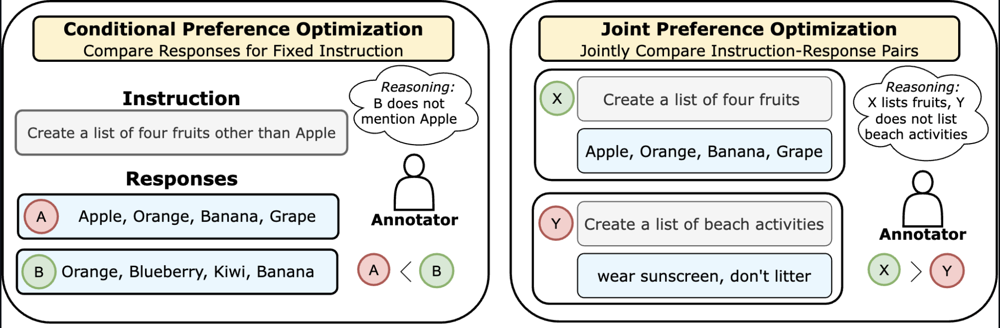

# DOVE
 
 
 


 
 
 
[[Paper](https://arxiv.org/abs/2404.00530)] [[🤗 Huggingface Dataset](https://huggingface.co/datasets/jointpreferences/sft_and_pref_data/tree/main/data)] [[🤗 Checkpoints](https://huggingface.co/jointpreferences)] [[Twitter](https://twitter.com/hbXNov)] 


<h1 align="center"></h1>
<p align="center"><i> DOVE 🕊️, a new objective for aligning LLMs that optimizes preferences over joint instruction-response pairs.</i>

 Code for the Paper "[Comparing Bad Apples to Good Oranges: Aligning Large Language Models via Joint Preference Optimization](https://arxiv.org/abs/2404.00530)".

:bell: If you have any questions or suggestions, please don't hesitate to let us know. You can comment on the [Twitter](https://twitter.com/hbXNov), or post an issue on this repository.

## Table of contents
- [About DOVE](https://github.com/Hritikbansal/dove/blob/main/README.md#-about-dove-)
- [Installation](https://github.com/Hritikbansal/dove/blob/main/README.md#-installation-)
- [Data](https://github.com/Hritikbansal/dove/blob/main/README.md#-data-)
- [Checkpoints](https://github.com/Hritikbansal/dove/blob/main/README.md#-checkpoints-)
- [Feedback Acquisition](https://github.com/Hritikbansal/dove/blob/main/README.md#-feedback-acquisition-)
  + [Conditional Rankings - Compare Two Responses for Identical Instructions](https://github.com/Hritikbansal/dove/blob/main/README.md#-conditional-rankings--compare-two-responses-for-identical-instructions-)
  + [Joint Rankings - Compare Two Instruction-Response Pairs](https://github.com/Hritikbansal/dove/blob/main/README.md#-joint-ranking--compare-two-instruction--response-pairs-)
- [Supervised Finetuning](https://github.com/Hritikbansal/dove/blob/main/README.md#-supervised-finetuning-)
- [DOVE](https://github.com/Hritikbansal/dove/blob/main/README.md#-dove-)
- [Evaluation](https://github.com/Hritikbansal/dove/blob/main/README.md#-evaluation-)

## About DOVE
Traditional conditional feedback approaches are limited in capturing the complex, multifaceted nature of human preferences! Hence, we collect human and AI preferences jointly over instruction-response pairs i.e., (I1,R1) vs (I2, R2). Joint preferences subsume conditional preferences when I1=I2. To learn from joint preferences, we introduce a new preference optimization objective. Intuitively, it upweights the joint probability of the preferred instruction-response pair over the rejected instruction-response pair. If instructions are identical, then DOVE boils down to DPO! 
<h1 align="center"></h1>

## Installation

Basic installation:

```
conda create -n dove python=3.10
conda activate dove
```

`pip install -r requirements.txt`

## Data

1. We upload the sample data used for the project in this repo in this [folder](data/).
2. SFT data, `train_sft.jsonl/val_sft.jsonl`, files for [openai_tldr](data/tldr/) and [anthropic_helpful](data/anthropic_helpful/).
3. Conditional rankings data, `train_conditional_pref.jsonl/val_conditional_pref.jsonl`, from ChatGPT-0125 for [openai_tldr](data/tldr/) and [anthropic_helpful](data/anthropic_helpful/).
4. Joints rankings data over non-identical instructions, `train_joint_pref.jsonl`, from ChatGPT-0125 for [openai_tldr](data/tldr/) and [anthropic_helpful](data/anthropic_helpful/).
5. By default, the DOVE approach can work on both the conditional and joint rankings. Hence, we train our models on the combination of the conditional and joint rankings.

🤗 Data is uploaded on Huggingface: [Link](https://huggingface.co/datasets/jointpreferences/sft_and_pref_data/tree/main/data)

## Checkpoints

We upload the trained SFT and DOVE checkpoints to huggingface 🤗.

| Model | Link    | 
| :-----: | :---: | 
| SFT (TLDR) | [Link](https://huggingface.co/jointpreferences/mistral_7b_lr_1.5e-6_sft)   | 
| SFT (Anthropic-Helpful) | [Link](https://huggingface.co/jointpreferences/mistral_7b_sft_helpful)   | 
| DOVE-LORA (TLDR) | [Link](https://huggingface.co/jointpreferences/dove_checkpoints/tree/main/tldr_dove)   | 
| DOVE-LORA (Anthropic-Helpful) | [Link](https://huggingface.co/jointpreferences/dove_checkpoints/tree/main/helpful_dove)   | 

Note: The LORA checkpoints are just the adapters parameters. You need to pass the path to the SFT model in the argument `base_model_name_or_path` in the `adapter_config.json` in the LORA folders.

## Feedback Acquisition

We provide the steps to acquire conditional rankings and joint rankings over instruction-response pairs.

1. Make it clear that the joint rankings are acquired over non-identical instructions.

### Conditional Rankings - Compare Two Responses for Identical Instructions

1. Assume that you have a jsonl file where each line is of the form:
```python
{'instruction': [instruction], 'response_0': [response 0], 'response_1': [response_1]}
```
2. Run the following python command:
```python
OPENAI_API_KEY=[OAI KEY] python dove/ai_feedback.py --mode single --input_data <data_file.jsonl> --output_data <output_data_file.jsonl>
```

### Joint Rankings - Compare Two Instruction-Response Pairs
1. Assume that you have a jsonl file where each line is of the form:
```python
{'instruction_0': [instruction_0], 'response_0': [response 0], 'instruction_1': [instruction_1], 'response_1': [response_1]}
```
2. Run the following python command:
```python
OPENAI_API_KEY=[OAI KEY] python dove/ai_feedback.py --mode pair --input_data <data_file.jsonl> --output_data <output_data_file.jsonl>
```

### Processing the output file

1. In the output file, our AI feedback appends a `feedback` attribute to each instance. Here, `feedback = 0` indicates that the first response is preferred. `feedback = 1` indicates that the second response is preferred. `feedback=2` implies that both responses are equally good/bad.
2. Once the output data files are ready, you can process to be of the form (say `pref.jsonl`):
```python
{'i_chosen': [chosen instruction], 'r_chosen': [chosen response], 'i_reject': [rejected instruction], 'r_reject': [rejected response]}
```
You will remove the responses that are considered `equal` while creating this file.

## Supervised Finetuning

1. Download the base Mistral-7B model from Huggingface [https://huggingface.co/mistralai/Mistral-7B-v0.1](https://huggingface.co/mistralai/Mistral-7B-v0.1).
2. We present the sample data for SFT in [data](data) folder for the openai TL;DR and anthropic-helpful datasets. The file names will be `train_sft.jsonl` or `val_sft.jsonl`.
3. Follow the steps mentioned in this [sft](sft/README.md) readme to install the relevant dependencies and perform full-finetuning of the Mistral-7B model. 
4. While we perform full-finetuning, huggingface TRL ([here](https://huggingface.co/docs/trl/en/sft_trainer#training-adapters)) supports finetuning 7B models with low-rank adaptation. Feel free to check them out.
5. We provide the SFT models for the TLDR and anthropic-helpful dataset in the [ModelZOO](dove/MODEL_ZOO.md).


## Sampling from SFT 

1. Once you have a SFT model, you can use our [inference.py](dove/inference.py) to sample from it.
2. We provide the test data files for [tldr](data/tldr/test.json) and [helpful](data/anthropic_helpful/test.jsonl) datasets. Specifically, these files are of the form: 
```python
{'instruction': [instruction], 'response': [response]}
```
3. Run the following python command:
```python
CUDA_VISIBLE_DEVICES=1 python dove/inference.py --model_path <path to sft model> --test_file [path to test file] --output_file [output file name] --temp 0.001 (default sampling temperature)
```
Note: We explicitly add the summarization format used to finetune SFT in the above script. Feel free to edit them.
4. The above code will generate a file of the form:
```python
{'instruction': [instruction], 'outputs': [outputs]}
```

## DOVE

1. We provide the sample data for conditional rankings (two responses, identical instrucution) and joint rankings over non-identical instructions for both datasets.
2. For example, conditional rankings data for anthropic-helpful is [train_pref](data/anthropic_helpful/train_conditional_pref.jsonl) and [val_pref](data/anthropic_helpful/val_conditional_pref.jsonl).
3. Joint rankings over non-identical instructions are present in [train_joint_pref](data/anthropic_helpful/train_joint_pref.jsonl) file.
4. As conditional rankings is the special case of the joint rankings when the instructions are identical, DOVE can utilize the diverse set of preferences.
5. Hence, the user can train on just the conditional rankings, joint rankings (non-identical instructions), merge both the conditional rankings and joint rankings (proposed setup in the paper).
6. We will start with the SFT model and align it with the DOVE algorithm. Run the following for alignment:
```python
CUDA_VISIBLE_DEVICES=1 python train.py --model_name_or_path <path to sft model> --dataset_name <path to train_pref file> --eval_dataset_name <path to val_pref file> --per_device_train_batch_size 8 --gradient_accumulation_steps 4 --output_dir <location where you want save the model ckpt> --joint_distribution True --max_steps 1000
```
7. Note 1: You can use the same command to align the LLM with DPO instead of DOVE by removing `--joint distribution True` command. 
8. Note 2: We recommend increasing the number of steps when you merge the conditional and joint rankings data to keep the number of epochs same. On a single GPU the number of epochs = (dataset size/(batch_size * gradient_accumulation_steps)).
9. This code will save the LORA adapters (instead of the complete model) in the `output_dir`. 

## Sampling from DOVE aligned LLM
1. Once you have a SFT model, you can use our [inference.py](dove/inference.py) to sample from it.
2. We provide the test data files for [tldr](data/tldr/test.json) and [helpful](data/anthropic_helpful/test.jsonl) datasets. Specifically, these files are of the form: 
```python
{'instruction': [instruction], 'response': [response]}
```
3. Run the following python command:
```python
CUDA_VISIBLE_DEVICES=1 python dove/inference.py --model_path <path to DOVE model (path to output dir)> --test_file [path to test file] --output_file [output file name] --temp 0.001 (default sampling temperature)
```
Note: The trained LORA checkpoint for DOVE automatically picks up the path to the SFT model as it is mentioned its adapter_config.json.
Note: We explicitly add the summarization format used to finetune SFT in the above script. Feel free to edit them.
4. The above code will generate a file of the form:
```python
{'instruction': [instruction], 'outputs': [outputs]}
```
5. Sample outputs are presented in [outputs](outputs/).

## Evaluation
1. We aim to assess the win-rate of the model generations when compared against the gold responses.
2. The code is mostly the same as AI feedback generation. 
3. Run the following command:
```python
OPENAI_API_KEY=[OAI KEY] python dove/auto_eval.py --input_data <generations file from previous section> --model_name <model_name> --test_data <test file with gold responses> --master_data <output file name (say master.json)>
```
